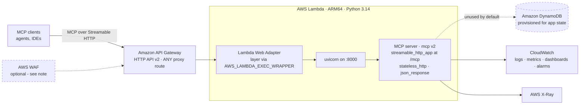
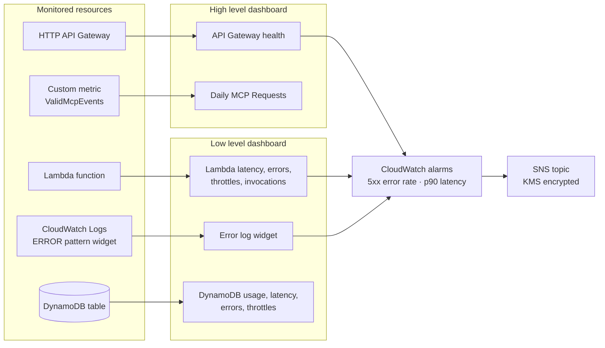

# AWS Lambda MCP Cookbook (Python)

[](https://github.com/ran-isenberg/aws-lambda-mcp-cookbook/blob/master/LICENSE)

[](https://codecov.io/github/ran-isenberg/aws-lambda-mcp-cookbook)


<a href="https://ranthebuilder.cloud/">
  
</a>

This project provides a working, open source based, AWS Lambda based Python MCP server implementation.

It is built on the AWS Lambda Web Adapter and the official [MCP Python SDK](https://github.com/modelcontextprotocol/python-sdk) (`mcp` v2), so it speaks the current `2026-07-28` MCP spec as well as older handshake-era clients.

It contains an opinionated implementation including DEPLOYMENT code with CDK and a CI/CD pipeline, testing, observability and more (see Features section).

This project is a blueprint for new Serverless MCP servers.

**[📜Documentation](https://ran-isenberg.github.io/aws-lambda-mcp-cookbook/)** | **[Blogs website](https://www.ranthebuilder.cloud)**
> **Contact details | mailto:ran.isenberg@ranthebuilder.cloud**

[](https://twitter.com/RanBuilder)
[](https://www.ranthebuilder.cloud/)


## Getting Started

You can start with a clean service out of this blueprint repository without using the 'Template' button on GitHub.

**That's it, you are ready to deploy the MCP server (make sure Docker is running!):**

```bash
cd {new repo folder}
make dev
make deploy
```

Check out the official [Documentation](https://ran-isenberg.github.io/aws-lambda-mcp-cookbook/).

You can also run 'make pr' will run all checks, synth, file formatters , unit tests, deploy to AWS and run integration and E2E tests.

## **The Problem**

Starting a Serverless MCP can be overwhelming. You need to figure out many questions and challenges that have nothing to do with your business domain:

* How to deploy to the cloud? What IAC framework do you choose?
* How to write a SaaS-oriented CI/CD pipeline? What does it need to contain?
* How do you handle observability, logging, tracing, metrics?
* How do you write a well-structured Lambda function?
* How do you handle testing?
* What makes an AWS Lambda handler resilient, traceable, and easy to maintain? How do you write such a code?

## **The Solution**

This project aims to reduce cognitive load and answer these questions for you by providing an opinionated Python Serverless MCP server blueprint that implements best practices for AWS Lambda, MCP, Serverless CI/CD, and AWS CDK in one project.

This project is a blueprint for new Serverless MCP servers.



> **AWS WAF is not attached today.** WAF cannot front an API Gateway **HTTP** API (v2) - only a REST API. `WafToApiGatewayConstruct` in `cdk/service/waf_construct.py` is kept as a working reference: wire it up if you switch the edge to a REST API GW.
>
> **DynamoDB is provisioned but unread.** The `2026-07-28` protocol is stateless, so nothing touches the table out of the box - see [Session data and DynamoDB](#session-data-and-dynamodb).


### Serverless Lambda Web Adapter & the official MCP Python SDK

Based on [AWS Lambda Web Adapter](https://github.com/awslabs/aws-lambda-web-adapter) and the official [MCP Python SDK](https://github.com/modelcontextprotocol/python-sdk) (`mcp` v2).

Use an HTTP API GW and Lambda function. Can be used with a REST API GW with a custom domain too.

The server is a plain ASGI (Starlette) app served by uvicorn behind the Lambda Web Adapter, so it upholds the official MCP protocol and has a native auth mechanism (OAuth).

The MCP surface is split by capability kind, mirroring the business logic layout so each protocol binding sits opposite the logic it exposes:

```text
service/
  app.py                     the ASGI app uvicorn serves - assembles everything below
  mcp_app/
    mcp_server.py            the MCPServer instance, its identity and instructions
    caching.py               cache hints advertised on catalog listings
    context.py               AppContext + lifespan (shared, per-process state)
    handlers/
      __init__.py            imports the modules below - this is what registers them
      tools.py               -> service/logic/math.py
      resources.py           -> service/logic/profiles.py
      prompts.py             -> service/logic/hld.py
```

A handler binds the protocol to a logic function and declares how clients may treat it - see [service/mcp_app/handlers/tools.py](service/mcp_app/handlers/tools.py):

```python
from mcp.types import ToolAnnotations

from service.handlers.utils.observability import logger
from service.logic.math import add_two_numbers
from service.mcp_app.mcp_server import mcp


@mcp.tool(
    title='Add two numbers',
    annotations=ToolAnnotations(  # lets clients decide what may run without asking
        read_only_hint=True,
        idempotent_hint=True,
        open_world_hint=False,
    ),
)
def math(a: int, b: int) -> int:
    """Add two numbers together"""
    logger.info('using math tool', extra={'a': a, 'b': b})
    return add_two_numbers(a, b)
```

> **Capabilities register on import.** `@mcp.tool()`, `@mcp.resource()` and `@mcp.prompt()` register when their module is imported, so a new handler module must be imported in [service/mcp_app/handlers/__init__.py](service/mcp_app/handlers/__init__.py). Forget it and the capability is silently missing from the catalog rather than raising - the listing tests in `tests/integration/test_mcp_server.py` are what catch that.

### Protocol versions

`streamable_http_app()` serves **both** MCP protocol eras from the same endpoint, routed per request by the `MCP-Protocol-Version` header:

* `2026-07-28` - the current stateless spec: no `initialize` handshake, no `Mcp-Session-Id`.
* `2025-11-25` and earlier - the handshake era, for clients that have not migrated yet.

There is nothing to configure; both are always on.

### Session data and DynamoDB

The `2026-07-28` protocol is stateless: no `initialize` handshake, no `Mcp-Session-Id`, and the server runs with `stateless_http=True`. Nothing is carried between requests for you.

That is a protocol change, not a restriction on your application. **The stack still provisions a DynamoDB table and passes its name to the Lambda as `TABLE_NAME`, so you can use it to store session or conversation state whenever you want it.** Nothing reads it out of the box - it is there for you to build on.

The `lifespan` yields a shared context object, and the table is resolved from `TABLE_NAME` on first use and reused thereafter - so the server still boots without any environment configured. A handler reaches it through the injected `Context`. The approach the spec recommends is a server-minted handle: your tool writes state to DynamoDB under a key it generates, returns that key to the client, and the client passes it back as an ordinary tool argument on the next call.

```python
from mcp.server.mcpserver import Context


@mcp.tool()
def start_analysis(dataset: str, ctx: Context) -> str:
    """Begin an analysis and return a handle to resume it."""
    handle = str(uuid.uuid4())
    ctx.request_context.lifespan_context.table.put_item(Item={'session_id': handle, 'dataset': dataset})
    return handle


@mcp.tool()
def continue_analysis(handle: str, ctx: Context) -> str:
    """Continue an analysis previously started with start_analysis."""
    state = ctx.request_context.lifespan_context.table.get_item(Key={'session_id': handle})['Item']
    ...
```

The table's partition key is `session_id`, and the Lambda role already grants `GetItem`, `PutItem`, `UpdateItem` and `DeleteItem` on it.

> **Note:** a handle is a bearer token - anyone holding it can read that state. Bind it to the caller's identity rather than trusting the handle alone.

### **Monitoring Design**


<br></br>

### **Features**

* Python Serverless MCP server with a recommended file structure.
* Official MCP Python SDK v2 - supports the current `2026-07-28` spec and older clients alike.
* MCP Tools input validation: check argument types and values
* Tests - unit, integration (in-process MCP client against the real server) and E2E with a real MCP client
* CDK infrastructure with infrastructure tests and security tests.
* CI/CD pipelines based on Github actions that deploys to AWS with python linters, complexity checks and style formatters.
* CI/CD pipeline deploys to dev/staging and production environments with different gates between each environment
* Makefile for simple developer experience.
* The AWS Lambda handler embodies Serverless best practices and has all the bells and whistles for a well-structured handler.
* AWS Lambda handler uses [AWS Lambda Powertools](https://docs.powertools.aws.dev/lambda-python/).
* AWS Lambda handler 3 layer architecture: handler layer, logic layer and data access layer
* CloudWatch dashboards - High level and low level including CloudWatch alarms

## CDK Deployment

The CDK code creates an HTTP API GW that proxies every path to the Lambda, which serves MCP at /mcp.

The AWS Lambda handler uses a Lambda layer optimization: `make build` exports the runtime dependencies from `pyproject.toml` with `uv export`, and CDK bundles them into a layer via Docker.

To package extra dependencies, add them to the `dependencies` list in `pyproject.toml`.

## Serverless Best Practices

The AWS Lambda handler will implement multiple best practice utilities.

Each utility is implemented when a new blog post is published about that utility.

The utilities cover multiple aspects of a well-structured service, including:

* [Logging](https://www.ranthebuilder.cloud/post/aws-lambda-cookbook-elevate-your-handler-s-code-part-1-logging)
* [Observability: Monitoring and Tracing](https://www.ranthebuilder.cloud/post/aws-lambda-cookbook-elevate-your-handler-s-code-part-2-observability)
* [Observability: Business KPIs Metrics](https://www.ranthebuilder.cloud/post/aws-lambda-cookbook-elevate-your-handler-s-code-part-3-business-domain-observability)
* [Environment Variables](https://www.ranthebuilder.cloud/post/aws-lambda-cookbook-environment-variables)
* [Input Validation](https://www.ranthebuilder.cloud/post/aws-lambda-cookbook-elevate-your-handler-s-code-part-5-input-validation)
* [Hexagonal Architecture](https://www.ranthebuilder.cloud/post/learn-how-to-write-aws-lambda-functions-with-architecture-layers)
* [CDK Best practices](https://github.com/ran-isenberg/aws-lambda-mcp-cookbook)
* [Serverless Monitoring](https://www.ranthebuilder.cloud/post/how-to-effortlessly-monitor-serverless-applications-with-cloudwatch-part-one)


## Security

* Use the SDK's `auth` parameter on `MCPServer` for an OAuth implementation, or put an IAM/Cognito/Lambda authorizer in front of the API Gateway.
* DNS rebinding protection is switched off in [service/app.py](service/app.py). That check exists to protect a server bound to a local port from browsers on the same machine; under the Lambda Web Adapter the app only listens on loopback inside the execution environment and API Gateway forwards its own Host header, so leaving it on would reject every request with `421 Misdirected Request`. API Gateway is where authn/authz belongs here.
* AWS WAF is **not** attached - see the note under the architecture diagram above.

### Known Issues

* There might be security issues with this implementation, MCP is very new and has many issues.

## Code Contributions

Code contributions are welcomed. Read this [guide.](https://github.com/ran-isenberg/aws-lambda-mcp-cookbook/blob/main/CONTRIBUTING.md)

## Code of Conduct

Read our code of conduct [here.](https://github.com/ran-isenberg/aws-lambda-mcp-cookbook/blob/main/CODE_OF_CONDUCT.md)

## Connect

- Email: ran.isenberg@ranthebuilder.cloud
- Blog: https://www.ranthebuilder.cloud
- Bluesky: [@ranthebuilder.cloud](https://bsky.app/profile/ranthebuilder.cloud)
- X:       [@RanBuilder](https://twitter.com/RanBuilder)
- LinkedIn: https://www.linkedin.com/in/ranbuilder/

## Credits

* [AWS Lambda Powertools (Python)](https://github.com/aws-powertools/powertools-lambda-python)
* [AWS Lambda Handler cookbook](https://ran-isenberg.github.io/aws-lambda-handler-cookbook/)
* [MCP Python SDK](https://github.com/modelcontextprotocol/python-sdk)
* [AWS Lambda Web adapter](https://github.com/awslabs/aws-lambda-web-adapter)

## License

This library is licensed under the MIT License. See the [LICENSE](https://github.com/ran-isenberg/aws-lambda-mcp-cookbook/blob/main/LICENSE) file.
